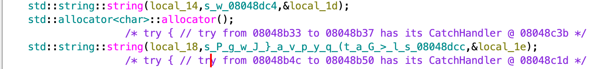
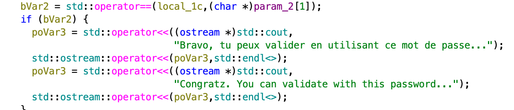
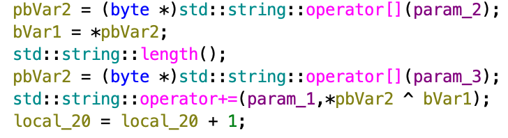
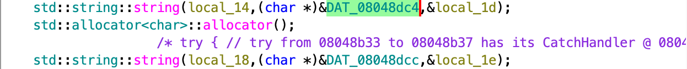

# ELF C++ - 0 protection

**Challenge Goal:** Find the correct password to validate the binary
**Binary Type:** 32-bit Linux ELF (C++)  
**Tools Used:** Ghidra/IDA Pro, GDB, ltrace, Python  

---
## Solution 1: Static Analysis
### 1. Analysis
Opening the binary in a disassembler Ghidra, I located the `main` function. The logic flow is:
1.  It prepares two hidden strings in memory (let's call them `string1` and `string2`).  



2.  It calls a function `plouf`, passing these two strings.


3.  It compares the result of `plouf` with our user input using `std::operator==`.



Inside the `plouf` function, we find a loop that iterates through the strings. The critical instruction is an XOR operation:



```cpp
// Decompiled Logic
result += char_from_string2 ^ char_from_string1
```
I looked at the memory address passed to the function (```DAT_08048dc4``` & ```DAT_08048dc4```) and extracted the raw hex bytes (remember to not extract 00 as this is a null byte) :




- Short : ```18 d6 15 ca fa 77```
- Long : ```50 b3 67 af a5 0e 77 a3 4a a2 9b 01 7d 89 61 a5 a5 02 76 b2 70 b8 89 03 79 b8 71 95 9b 28 74 bf 61 be 96 12 47 95 3e e1 a5 04 6c a3 73 ac 89```

As there are a long and a short string, this is the **Rolling XOR (Vigenère)** encryption. The program uses a short "Key" string to decrypt a long "Cipher" string byte-by-byte.

### 2. Solver script
```python
key = bytearray([0x18, 0xd6, 0x15, 0xca, 0xfa, 0x77])
strings = bytearray([ 0x50, 0xb3, 0x67, 0xaf, 0xa5, 0x0e, 0x77, 0xa3, 0x4a, 0xa2, 0x9b, 0x01, 0x7d, 0x89, 0x61, 0xa5, 0xa5, 0x02, 0x76, 0xb2, 0x70, 0xb8, 0x89, 0x03, 0x79, 0xb8, 0x71, 0x95, 0x9b, 0x28, 0x74, 0xbf, 0x61, 0xbe, 0x96, 0x12, 0x47, 0x95, 0x3e, 0xe1, 0xa5, 0x04, 0x6c, 0xa3, 0x73, 0xac, 0x89])

password = ""
i = 0
for char in strings:
    result = key[i%6] ^ strings[i]
    password += chr(result)
    i = i + 1
print(password)
```

The passwword is: ```
Here_you_have_to_understand_a_little_C++_stuffs ```
